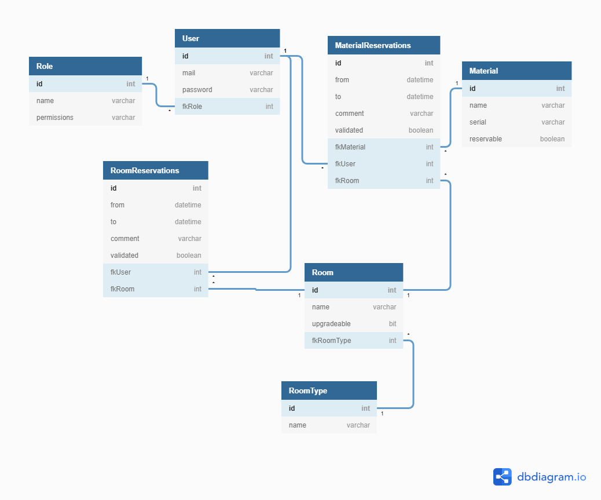

# RoomManager

## BDD

SQLite a été par sa légèreté et les besoins faibles de RoomManager.

**Cependant, il convient d'arranger RoomManager pour faire en sorte qu'à l'avenir une nouvelle BDD (ou autre système d'enregistrement de données) puisse être facilement ajouté**

=> Faisable avec une interface "RoomManagerRepository" qui contient des méthodes d'ajout, de suppression, etc de données depuis la base de données et de configuration et des classes concrètes (Par ex SqlLiteRoomManagerRepository)

=> pattern repository

### Schéma de base de données

